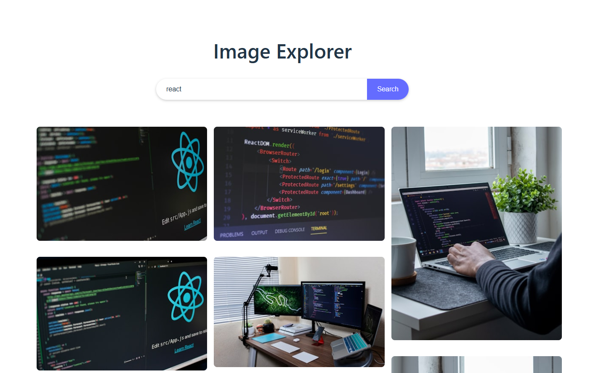

# **Image Explorer**

This project is part of my **React Practice Series**, a personal collection of frontend exercises focused on improving fluency, architectural clarity, and emotionally intelligent UI design.



---

## **Purpose**

To practice:

- Modular React components with scoped CSS
- Async API integration with editorial error handling
- Responsive layout using pure CSS Columns
- Emotionally clear search flow and naming for onboarding clarity
- Defensive input validation and accessibility-first markup

---

## **Features**

- **Search bar** with editorial styling and responsive behavior
- **Lazy-loaded image results** from the Unsplash API
- **Masonry-style grid layout** using pure CSS Columns
- **ARIA-friendly markup** and semantic HTML for accessibility
- **Defensive handling** of empty search terms
- **Responsive design** for mobile, tablet, and desktop

---

## **Structure**

- `components/`: Modular UI (SearchBar, ImageGrid, ImageCard)
- `api/`: Unsplash API integration with key separation
- `styles/`: Global CSS with responsive media queries
- `App.jsx`: Central logic for search flow, loading, and error states

---

## **Design Notes**

This project is intentionally small in scope but rich in clarity. Every component is built with **teachability and onboarding in mind**, making it ideal for interviews, documentation, and collaborative debugging.

The layout uses **CSS Columns** for a lightweight masonry effect, and the search flow is designed to be **emotionally intuitive**, with clear feedback for loading, errors, and empty results.

---

## **Technologies Used**

- **React** – Component-based UI development
- **Vite** – Fast build tool and development environment
- **CSS** – Custom styling with semantic HTML and responsive layout
- **Unsplash API** – Free, high-quality image search API

---

## **Getting Started**

### **Installation & Setup**

1. Clone the repository:

   ```bash
   git clone https://github.com/maitepv87/image-explorer.git
   cd image-explorer
   ```

2. Install dependencies:

   ```bash
   npm install
   ```

3. Set up environment variables in a .env file:

   ```bash
   VITE_API_BASE_URL=https://api.unsplash.com/
   VITE_API_KEY=your_unsplash_access_key
   ```

4. Start the development server:

   ```bash
   npm run dev
   ```

Then open http://localhost:3000 in your browser.
